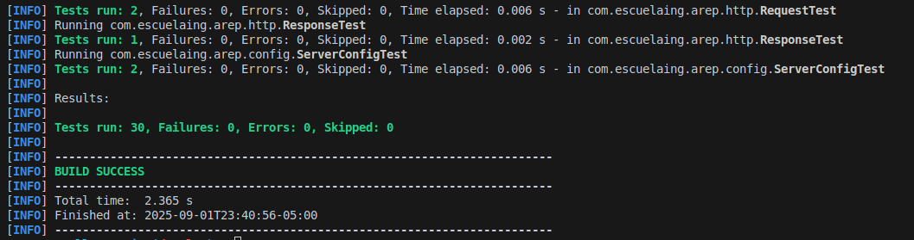
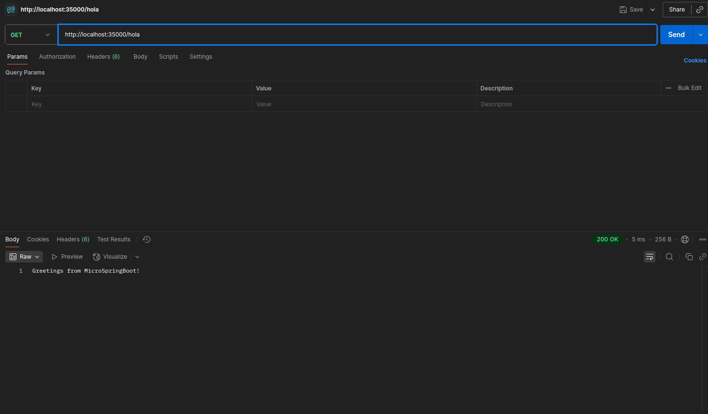
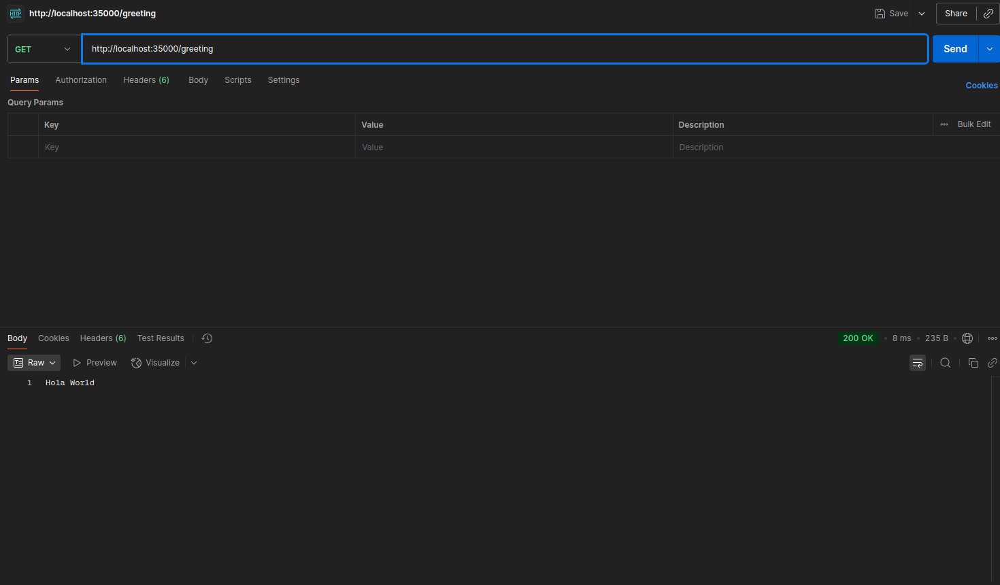
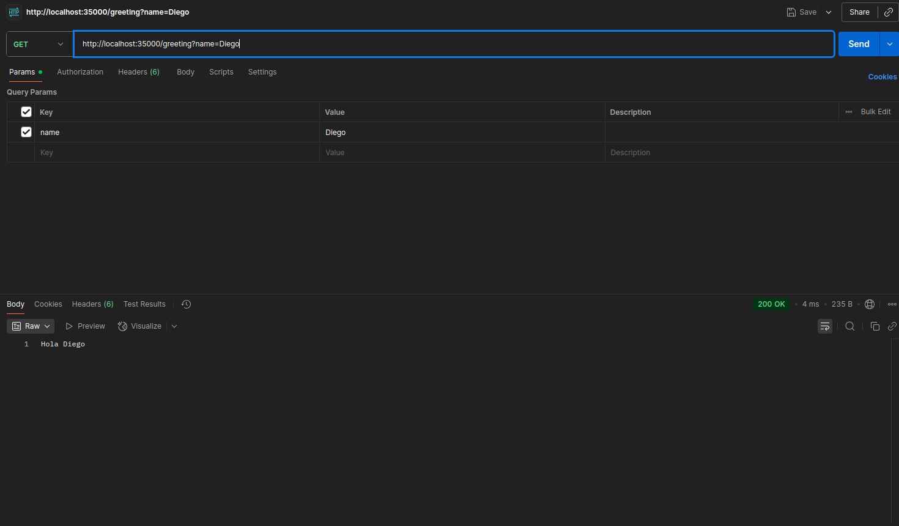
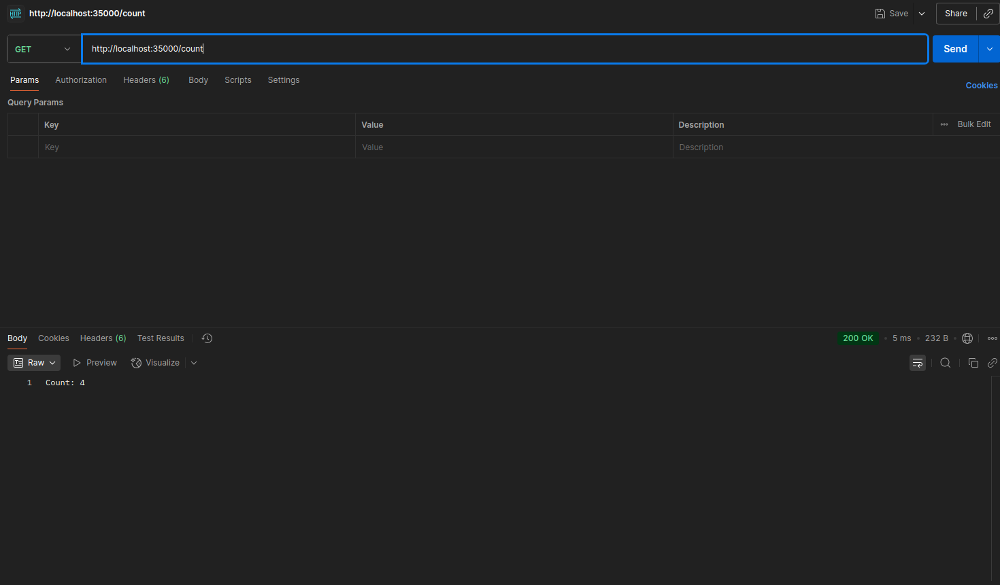

# WebApp Framework – Minimalist HTTP Server in Java


## Description and Objective

This project is a sequential web server implemented from scratch in Java 21, capable of delivering HTML pages and PNG images. It includes an IoC microframework that allows web applications to be built from POJOs using annotations (@RestController, @GetMapping, @RequestParam), demonstrating Java's reflective capabilities.

> **Academic Objective:** Enterprise Architecture Exercise (AREP) – Workshop 3. The server must serve multiple non-concurrent requests and serve as a basis for exploring concepts of reflection, dependency injection, and dynamic routing in Java.

## Main Features

- Custom HTTP server (no external frameworks)
- Static file delivery (HTML, CSS, JS, PNG/SVG images)
- Simple MIME type detection
- IoC framework for annotated controllers
- Automatic controller discovery (@RestController)
- GET routes using @GetMapping and parameters using @RequestParam
- Example of a web application built on the framework
- Basic error handling (400, 404, 500) and open CORS for GET/POST/OPTIONS

## Annotation Usage Example

```java
import com.escuelaing.arep.annotations.GetMapping;
import com.escuelaing.arep.annotations.RequestParam;
import com.escuelaing.arep.annotations.RestController;

@RestController
public class DemoController {
@GetMapping("/hello")
public String hello(@RequestParam(value = "name", defaultValue = "World") String name) {
return "Hello " + name;
}
}
```

## Automatic Controller Discovery

The framework scans the classpath for classes annotated with @RestController and automatically registers methods annotated with @GetMapping. Parameters are injected using @RequestParam, allowing dynamic endpoints to be built without manual configuration.


## 🚀 Quick Start

### Prerequisites

- Java 21+
- Maven 3.6+
- Docker (optional for containerization)

### Installation Methods and Execution

#### Option 1: Direct Execution with Maven

```bash
# Clone and compile
git clone https://github.com/diegcard-arep/arep-taller-3.git
cd arep-taller-3
mvn clean compile
```

```bash
# Run server (recommended)
mvn exec:java -Dexec.mainClass="com.escuelaing.arep.RestApiDemo"

# Alternatives
java -cp target/classes com.escuelaing.arep.RestApiDemo
java -cp target/urlobject-1.0-SNAPSHOT.jar com.escuelaing.arep.RestApiDemo
```

## Command line invocation example

First version (manual POJO loading):

```bash
java -cp target/classes co.edu.escuelaing.reflexionlab.MicroSpringBoot co.edu.escuelaing.reflexionlab.FirstWebService
```

Final version (automatic discovery):

The framework detects and registers all controllers annotated in the classpath, without the need to specify them on the command line.

## Requirements

- Java 21+
- Maven 3.9+
- Docker 24+ (optional)

## Quick Start

Compile and run with standalone JAR:

```bash
mvn clean package
java -jar target/urlobject-1.0-SNAPSHOT.jar
```

Access in the browser:

```text
http://localhost:35000
```

Run from main class (IDE): `com.escuelaing.arep.HttpServer`.

> [!TIP]
> Static files are served from `target/classes/static`. Make sure to compile before running so that the resources are available.

## Docker

Build and run with Docker Compose:

```bash
docker-compose up --build
```

Build and run manually:

```bash
docker build -t arep-taller-3 .
docker run -p 35000:35000 --name arep-taller-3 arep-taller-3
```

> [!IMPORTANT]
> The port is fixed in the code (`ServerConfig.PORT = 35000`). The `PORT` environment variable defined in the Dockerfile is not yet used to configure the server.

## Implemented Endpoints

- GET `/hello` → fixed `HelloController` greeting
- GET `/greeting?name=YourName` → custom greeting (with `defaultValue = "World"`)
- GET `/count` → incrementing counter in memory

> [!NOTE]
> The UI includes buttons for `/api/hello`, `/api/weather`, and `/api/quote` as consumption examples; these endpoints are not implemented on the server and will return 404 until added.

## Configuration

Change the server port:

```java
import com.escuelaing.arep.config.ServerConfig;

ServerConfig.setPort(8080);
```

Change the static files directory at runtime:

```java
import com.escuelaing.arep.HttpServer;

HttpServer.setStaticFilesDirectory("/static"); // default
// or an alternative relative path
HttpServer.setStaticFilesDirectory("src/main/resources/static");
```

Supported MIME types (simplified):

- html, htm → text/html
- css → text/css
- js → application/javascript
- png → image/png
- jpg, jpeg → image/jpeg
- gif → image/gif
- svg → image/svg+xml
- ico → image/x-icon
- txt → text/plain

## Tests

Running unit tests:

```bash
mvn test
```



Test coverage (high level):

- Request/Response parsing
- Controller discovery and routing (`ClassScanner`, `RouteInfo`)
- Example controllers (`HelloController`, `GreetingController`)
- Basic `HttpServer` integration

## Current Limitations

- Concurrency: sequential server (one request at a time)
- Only GET for annotations; POST/PUT/DELETE not implemented
- File caching without LRU/LFU policies or global memory limits
- No automatic JSON serialization or content negotiation
- No scanning of classes within JARs
- No hot-reload or templates

## Endpoint Testing (Postman)

Screenshots of the tests performed with Postman for the deployed endpoints should be included below. You can add images of the responses for each endpoint, for example:

- **GET /hola**

- **GET /greeting**

- **GET /greeting?name=Diego**

- **GET /count**


## 👨‍💻 Author

**Diego Cardenas** - [diegcard](https://github.com/diegcard)

## 📄 License

This project is licensed under the MIT License - see [LICENSE.md](LICENSE.md) for details.

## 🎓 Academic Context

**Julio Garavito Colombian School of Engineering**
**Enterprise Architectures (AREP) - Workshop 3**

### Learning Objectives

- Implementing HTTP servers from scratch
- Developing minimalist web frameworks
- Handling network protocols in Java
- Containerization with Docker
- Distributed architectures and microservices