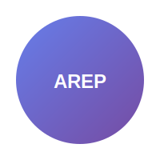
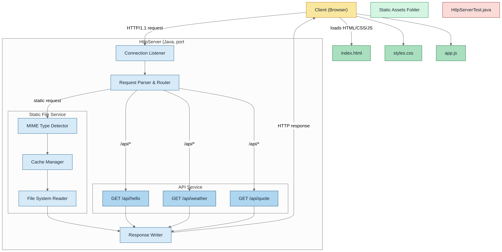

# WebApp Framework – Servidor HTTP minimalista en Java



Un servidor HTTP secuencial implementado desde cero en Java 21, con soporte para archivos estáticos, descubrimiento de controladores por anotaciones y ruteo básico vía un micro-framework IoC (anotaciones @RestController, @GetMapping y @RequestParam).

> Objetivo académico: ejercicio de Arquitecturas Empresariales (AREP) – Taller 3.


## Características

- Servidor HTTP propio (sin frameworks externos)
- Archivos estáticos con caché en memoria (hasta 1 MB por archivo)
- Detección simple de MIME types (html, css, js, imágenes, svg, txt)
- Rutas GET mediante controladores anotados (@RestController + @GetMapping)
- Inyección de parámetros de consulta con @RequestParam (valores por defecto)
- Manejo de errores básicos (400, 404, 500) y CORS abierto para GET/POST/OPTIONS

> [!NOTE]
> El ruteo actual es secuencial y soporta únicamente GET por anotaciones. Los formularios de la UI incluyen ejemplos “simulados” para POST y endpoints /api/* que aún no están implementados en el servidor.


## Arquitectura



Componentes clave:

- `HttpServer`: servidor, manejo de peticiones, ruteo y archivos estáticos
- `config/ServerConfig`: configuración (puerto, directorio estático)
- `utils/ClassScanner`: escaneo de clases anotadas en el classpath
- `framework/RouteInfo`: invocación por reflexión de métodos anotados
- `annotations/*`: anotaciones simples para construir el micro-framework
- `controllers/*`: controladores de ejemplo


## Estructura del proyecto

```text
arep-taller-3/
├─ src/
│  ├─ main/java/com/escuelaing/arep/
│  │  ├─ HttpServer.java
│  │  ├─ config/ServerConfig.java
│  │  ├─ utils/ClassScanner.java
│  │  ├─ annotations/{GetMapping, RequestParam, RestController}.java
│  │  ├─ framework/{RouteInfo, RouteHandler, Router}.java
│  │  └─ controllers/{HelloController, GreetingController}.java
│  └─ main/resources/static/{index.html, styles.css, app.js, logo.svg}
├─ Dockerfile
├─ docker-compose.yml
├─ pom.xml
└─ README.md
```


## Requisitos

- Java 21+
- Maven 3.9+
- Docker 24+ (opcional)


## Inicio rápido

Compilar y ejecutar con JAR autónomo:

```bash
mvn clean package
java -jar target/urlobject-1.0-SNAPSHOT.jar
```

Accede en el navegador:

```text
http://localhost:35000
```

Ejecutar desde clase principal (IDE): `com.escuelaing.arep.HttpServer`.

> [!TIP]
> Los archivos estáticos se sirven desde `target/classes/static`. Asegúrate de compilar antes de ejecutar para que los recursos estén disponibles.


## Docker

Build y ejecución con Docker Compose:

```bash
docker-compose up --build
```

Build y ejecución manual:

```bash
docker build -t arep-taller-3 .
docker run -p 35000:35000 --name arep-taller-3 arep-taller-3
```

> [!IMPORTANT]
> El puerto se encuentra fijo en el código (`ServerConfig.PORT = 35000`). La variable de entorno `PORT` definida en el Dockerfile no se usa aún para configurar el servidor.


## Endpoints implementados

- GET `/hola` → saludo fijo de `HelloController`
- GET `/greeting?name=TuNombre` → saludo personalizado (con `defaultValue = "World"`)
- GET `/count` → contador incremental en memoria

> [!NOTE]
> La UI incluye botones para `/api/hello`, `/api/weather`, `/api/quote` como ejemplos de consumo; dichos endpoints no están implementados en el servidor y retornarán 404 hasta ser agregados.


## Uso de las anotaciones (ejemplo)

```java
import com.escuelaing.arep.annotations.GetMapping;
import com.escuelaing.arep.annotations.RequestParam;
import com.escuelaing.arep.annotations.RestController;

@RestController
public class DemoController {
    @GetMapping("/hello")
    public String hello(@RequestParam(value = "name", defaultValue = "World") String name) {
        return "Hello " + name;
    }
}
```

Cómo funciona:

- `ClassScanner` detecta clases con `@RestController` bajo `com.escuelaing.arep.controllers`
- `HttpServer` registra métodos `@GetMapping` y hace binding de parámetros con `@RequestParam`
- El método se invoca por reflexión y la respuesta se serializa como texto plano


## Configuración

Cambiar el puerto del servidor:

```java
import com.escuelaing.arep.config.ServerConfig;

ServerConfig.setPort(8080);
```

Cambiar el directorio de archivos estáticos en tiempo de ejecución:

```java
import com.escuelaing.arep.HttpServer;

HttpServer.setStaticFilesDirectory("/static"); // por defecto
// o una ruta relativa alternativa
HttpServer.setStaticFilesDirectory("src/main/resources/static");
```

MIME types soportados (simplificado):

- html, htm → text/html
- css → text/css
- js → application/javascript
- png → image/png
- jpg, jpeg → image/jpeg
- gif → image/gif
- svg → image/svg+xml
- ico → image/x-icon
- txt → text/plain


## Pruebas

Ejecutar pruebas unitarias:

```bash
mvn test
```

Cobertura de pruebas (alto nivel):

- Parsing de Request/Response
- Descubrimiento de controladores y ruteo (`ClassScanner`, `RouteInfo`)
- Controladores de ejemplo (`HelloController`, `GreetingController`)
- Integración básica del `HttpServer`


## Limitaciones actuales

- Concurrencia: servidor secuencial (un request a la vez)
- Solo GET por anotaciones; POST/PUT/DELETE no implementados
- Caché de archivos sin políticas LRU/LFU ni límites globales de memoria
- No hay serialización JSON automática ni content negotiation
- No escanea clases dentro de JARs
- No hay hot-reload ni plantillas


## Roadmap sugerido (mejoras)

- Soporte concurrente (thread-per-connection o pool de hilos)
- Soporte a más métodos HTTP y cuerpo de petición (POST/PUT/DELETE)
- Serialización JSON y tipos de contenido configurables
- Middleware/filtros (logging, CORS, compresión Gzip, seguridad básica)
- Configuración por variables de entorno (PORT, STATIC_DIR)
- Cache con estrategia y límites configurables
- Descubrimiento de controladores también desde JARs
- Mapeo 404/500 personalizable y página de error
- Integración CI y reporte de cobertura


## Créditos

Autor: Diego Cardenas — Escuela Colombiana de Ingeniería Julio Garavito — AREP